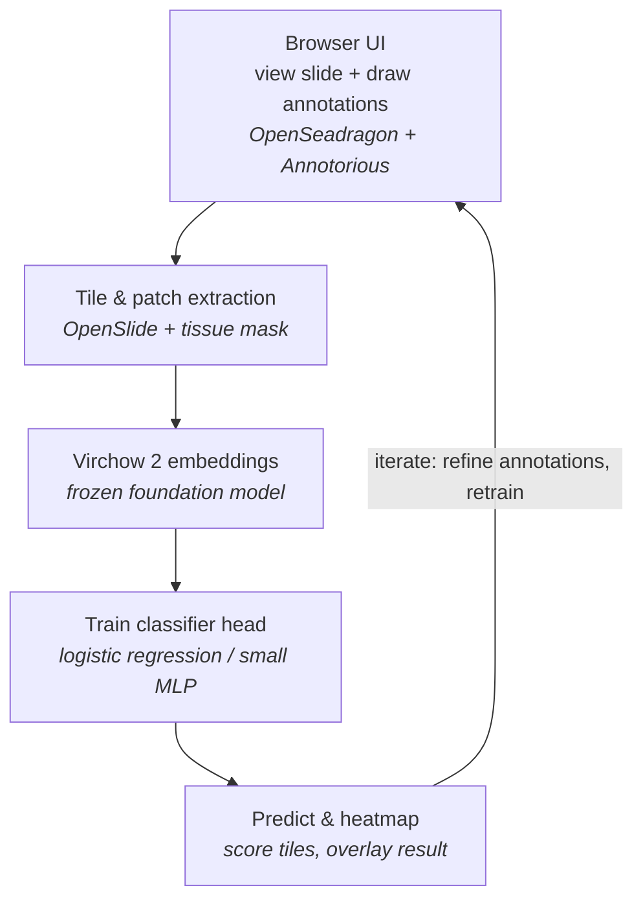

# SlideProbe

> Working name — rename freely. "Probe" refers to the linear-probe pattern at the core of
> the design: a lightweight classifier trained on frozen pathology foundation-model embeddings.

A **local, browser-based tool for analyzing whole slide images (WSI)** in pathology. Annotate
structures or regions of interest on a slide, and the app uses a pathology foundation model
(**Virchow 2**) as a frozen feature extractor to train a lightweight classifier that finds
those structures across the slide — and across slides. Think **[Aiforia](https://www.aiforia.com/)**,
but lean and running entirely on your own machine.

> ⚠️ **Research and development use only.** This is not a diagnostic device and is not intended
> for clinical use.

---

## How it works

Despite being "browser-based," this is a **local client–server application**, not a pure
web page. Whole slide images require native libraries to read, and the foundation model runs
in PyTorch — neither can live in a browser. So a small Python server runs on `localhost` and
does the heavy lifting; the browser handles viewing and annotation. You just open a tab at
`http://127.0.0.1:8000`.



**The core idea:** Virchow 2 is used *frozen* — never trained or fine-tuned. Pretrained on
3.1 million slides, it turns any 224×224 tissue tile into a numeric fingerprint (embedding).
All the actual learning happens in a tiny classifier on top of those fingerprints, which is
why the tool works with only a handful of annotations.

---

## Features (target)

- Smooth gigapixel slide viewing (`.svs`, `.ndpi`, `.mrxs`, and more via OpenSlide)
- Draw and manage region annotations directly on the slide
- One-click training of a classifier from your annotations
- Whole-slide prediction with a heatmap overlay
- Active-learning loop: correct predictions, add annotations, retrain
- Runs fully locally — slides never leave your machine

---

## Tech stack

| Layer      | Technology                                   |
|------------|----------------------------------------------|
| Viewer     | [OpenSeadragon](https://openseadragon.github.io/) |
| Annotation | [Annotorious](https://annotorious.dev/) (OpenSeadragon plugin) |
| Backend    | Python + [FastAPI](https://fastapi.tiangolo.com/) |
| Slide I/O  | [OpenSlide](https://openslide.org/)          |
| Model      | [PyTorch](https://pytorch.org/) + [timm](https://github.com/huggingface/pytorch-image-models) + Hugging Face Hub |
| Classifier | scikit-learn (baseline) → PyTorch MLP        |

---

## Prerequisites

- **Python 3.10+**
- **OpenSlide system library**
  ```bash
  sudo apt install openslide-tools        # Debian / Ubuntu
  # macOS: brew install openslide
  ```
- **A GPU is strongly recommended** for foundation-model inference (CPU works but is slow).
- **Hugging Face access to Virchow 2.** The model is *gated*: request access at
  [`paige-ai/Virchow2`](https://huggingface.co/paige-ai/Virchow2), wait for approval, then
  authenticate:
  ```bash
  huggingface-cli login
  ```

---

## Getting started

> The project is in early development — the phases below are the build plan, not a finished
> product. See `CLAUDE.md` for detailed architecture and per-phase guidance.

```bash
# 1. Clone and enter the repo
git clone <your-repo-url> && cd slideprobe

# 2. Install dependencies
pip install -r requirements.txt

# 3. Put a sample WSI in data/slides/

# 4. Run the local app
uvicorn backend.app:app --reload --port 8000

# 5. Open http://127.0.0.1:8000
```

---

## Roadmap

Built as the thinnest possible end-to-end slice first, then thickened. Each phase produces
something that runs.

1. **One slide on screen** — serve DeepZoom tiles from a WSI; display in OpenSeadragon.
2. **Annotation** — draw regions with Annotorious; save as JSON.
3. **Patch extraction** — cut 224×224 tiles under annotations; filter out background.
4. **Embeddings** — run patches through Virchow 2; cache the vectors.
5. **Train the head** — logistic regression on embeddings; report precision/recall.
6. **Predict + overlay** — score the whole slide; show a heatmap.
7. **Close the loop + polish** — correct/retrain cycle, multiple classes, project management.

---

## Foundation model & license

This project uses **Virchow 2** (`paige-ai/Virchow2`), a ViT-H/14 pathology foundation model
(~632M parameters) producing a 2560-dim embedding per tile (class token + mean patch tokens).

**Virchow 2 is licensed CC-BY-NC-ND 4.0 — non-commercial and no-derivatives.** That's fine for
personal, research, or internal use, but it **prohibits commercial use**. If you intend to
commercialize, swap in a differently-licensed model (the original **Virchow** is Apache 2.0;
**UNI2** and **H-optimus** have their own terms). The embedding backend is designed to be
swappable to make this a one-file change. *This is a licensing note, not legal advice — read
the model's actual terms.*

---

## Related / prior art worth reusing

You don't have to build everything from scratch. Strongly consider these for the backend:

- **[QuPath](https://qupath.github.io/)** — mature open-source desktop pathology app; great for
  prototyping annotation + classifier workflows.
- **[TIAToolbox](https://github.com/TissueImageAnalytics/tiatoolbox)** — Python WSI toolkit with
  patch extraction and foundation-model feature extraction.
- **[Slideflow](https://github.com/jamesdolezal/slideflow)** — end-to-end deep-learning pathology
  pipeline with a GUI.

The differentiated value of this project is the lean annotation → model experience — not
re-implementing slide I/O or feature extraction.

---

## Acknowledgments

- Virchow 2 by **Paige** and **Microsoft Research**.
- Built on the open-source pathology and imaging ecosystem: OpenSlide, OpenSeadragon,
  Annotorious, timm, and Hugging Face.

## License

TBD — choose a project license that is compatible with your foundation model's terms and your
intended use (commercial vs. non-commercial). Note that the Virchow 2 license constrains how
the *overall tool* may be used, regardless of your own code's license.
